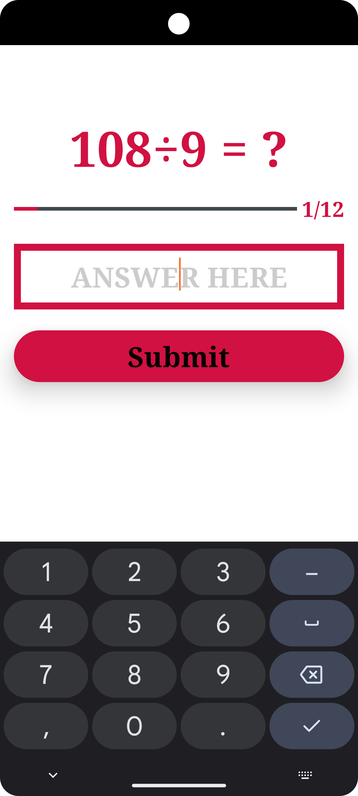

# ✖ Maths Quiz App ➗

An Android mathematics quiz application built using Kotlin and Jetpack Compose. This application
serves as a portfolio piece demonstrating my software engineering skills and approach to Android
development.

## Project Overview

Designed with clean architecture in mind, the app currently offers multiplication and division
quizzes for numbers ranging from 1 to 12. The project integrates modern Android development
techniques, including dependency injection with Hilt and persistence with Room.

## Technical Stack & Architecture

- **Language**: 100% Kotlin
- **UI Framework**: Jetpack Compose
- **Architecture**: MVVM with Clean Architecture principles
- **Dependency Injection**: Hilt
- **Local Database**: Room
- **Testing**: JUnit

## Key Features

- **Operation Selection**: Choose between multiplication and division
- **Customizable Difficulty**: Practice with numbers from 1 to 12
- **Performance Tracking**: View statistics and progress over time
- **Persistence**: All quiz results are saved using Room database.
    - You can filter the results by number, operation or both
- **Offline-First**: Works without internet connection

## Implementation Highlights

- **Reactive UI**: Implemented with Jetpack Compose and StateFlow for reactive state management
- **Repository Pattern**: Abstracts data sources and provides a clean API to the rest of the app
- **Dependency Injection**: Leverages Hilt for proper dependency management and testability
- **Database Migrations**: Proper handling of schema changes using Room migrations
- **Error Handling**: Comprehensive error handling throughout the app
- **Kotlin Features**: Extensive use of Kotlin features like coroutines, flow, and extension
  functions

## Screenshots
<table>
  <!-- Row 1 -->
  <tr>
    <td style="text-align:center">
      
      <p><em>Maths Quiz Splash Screen</em></p>
    </td>
    <td style="text-align:center">
      
      <p><em>Landing Screen</em></p>
    </td>
    <td style="text-align:center">
      
      <p><em>Select Operation Screen</em></p>
    </td>
  </tr>

  <!-- Row 2 -->
  <tr>
    <td style="text-align:center">
      
      <p><em>Selecting the number - Divide</em></p>
    </td>
    <td style="text-align:center">
      
      <p><em>Record Shop Home Screen</em></p>
    </td>
    <td style="text-align:center">
      
      <p><em>Quiz Question Screen</em></p>
    </td>
  </tr>

<!-- Row 3 -->
  <tr>
    <td style="text-align:center">
      
      <p><em>Quiz Question Screen - Division</em></p>
    </td>
    <td style="text-align:center">
      
      <p><em>Quiz Result Screen</em></p>
    </td>
    <td style="text-align:center">
      
      <p><em>History Screen</em></p>
    </td>
  </tr>
</table>

## Future Enhancements

- Add support for addition and subtraction operations
- Implement user profiles to track individual progress
- Enhance UI with animations and transitions
- Add gamification elements (badges, streaks, etc.)
- Implement dark mode and additional themes

## Getting Started

### Prerequisites

- Android Studio Flamingo (2022.2.1) or newer
- JDK 11 or higher
- Android SDK 21+

### Installation

1. Clone the repository:

    ```bash
     git clone https://github.com/tchabva/MathsQuizApp.git
    ```
2. Open the project in Android Studio
3. Sync Gradle and build the project
4. Run on an emulator or physical device (min SDK 21)

## Contact

Feel free to reach out for any questions or collaboration opportunities!

- GitHub: [tchabva](https://github.com/tchabva)
- Email: [tawandachabva@gmail.com](mailto:tawandachabva@gmail.com)
- LinkedIn: [linkedin.com/in/tawandachabva](https://www.linkedin.com/in/tawandachabva/)

---

**Note**: This project is continuously evolving as I implement new features and explore additional
technologies.